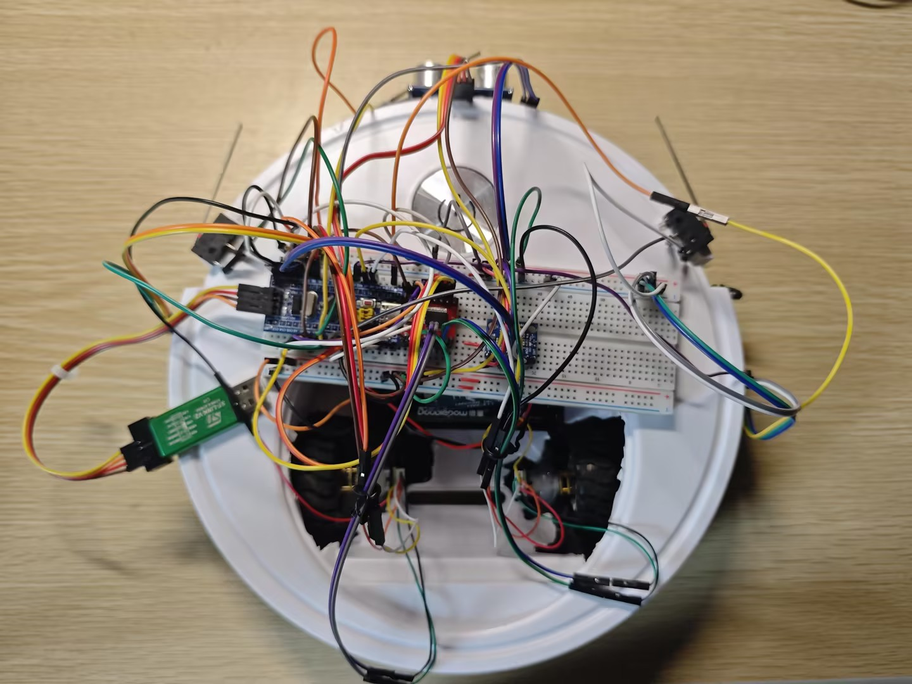
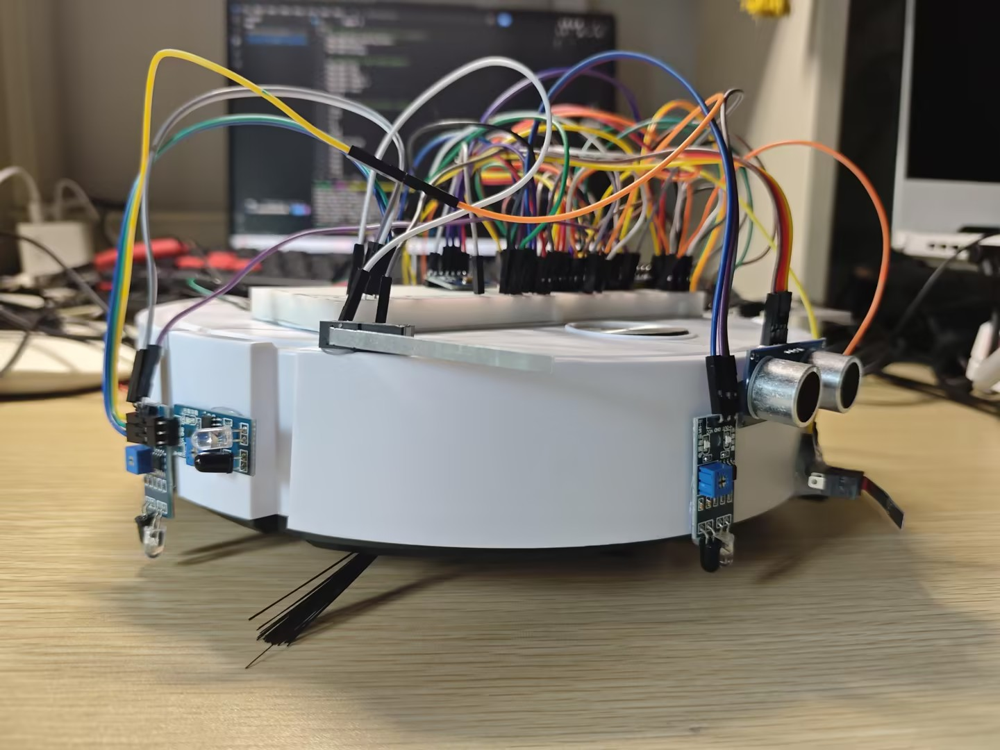

#  STM32 Autonomous Sweeping Robot (自主移动扫地机器人)

<p align="center">
  
</p>
<p align="center">
  <i>基于基础玩具底盘与面包板的快速原型验证机 (V1.0)</i>
</p>

<p align="center">
  
</p>
<p align="center">
  <i>硬件细节：面包板走线、电机驱动 (TB6612)、六轴姿态传感器 (MPU6050) 与超声波传感器布局</i>
</p>

##  硬件架构与核心技术栈 (Hardware & Tech Stack)

本项目主打快速原型开发 (Rapid Prototyping)**。基于基础玩具底盘，通过面包板与杜邦线完成了纯手工的硬件拓扑重构与底层驱动开发。

* **主控大脑**：STM32F103c8t6  (基于 STM32 HAL 库开发)
* **底盘与动力系统 (核心重构)**：
  * **底盘**：低成本扫地机外壳二次开发，纯手工搭建内部面包板级控制电路。
  * **执行器**：双路 GA12-N20 微型减速电机，紧凑且扭矩输出平稳。
  * **驱动器**：TB6612FNG 双路电机驱动模块，发热更小、效率更高。
* **闭环运动控制**：
  * 利用 N20 电机尾部自带的**霍尔编码器**进行高精度测速与里程计解算。
  * 编写速度/位置双闭环 PID 控制算法，确保小车在自制底盘上依然能保持直线行驶与精准原地转向。
* **姿态解算**：
  * 集成 MPU6050 六轴传感器，基于底层 I2C (0x78) 通信读取原始数据。
  * 实现偏航角 (Yaw) 的精确积分与静态零漂补偿，用于巡航方向的动态矫正。
* **环境感知**：
  * **超声波测距 (HC-SR04)**：负责中远距离的前方障碍物探测。
  * **红外防跌落 (Cliff Sensor)**：底盘边缘部署红外传感器，实时监测地面高低差。
  * **机械碰撞开关 (Bumper)**：作为最后一道物理防线，处理盲区内的直接物理接触。

## 工程目录结构 (Project Structure)

为了保证代码的纯净与协同开发效率，本仓库严格遵守标准嵌入式工程规范，已过滤所有编译中间产物。

```text
├── Core/               # 核心应用层代码 (main.c, PID 算法, 导航状态机, MPU6050姿态解算)
├── Drivers/            # 底层驱动层代码 (STM32_HAL_Driver)
├── docs/               # 项目文档与实物展示图
├── MDK-ARM/            # Keil uVision5 工程配置文件
└── .gitignore          # Git 提交流程规范配置